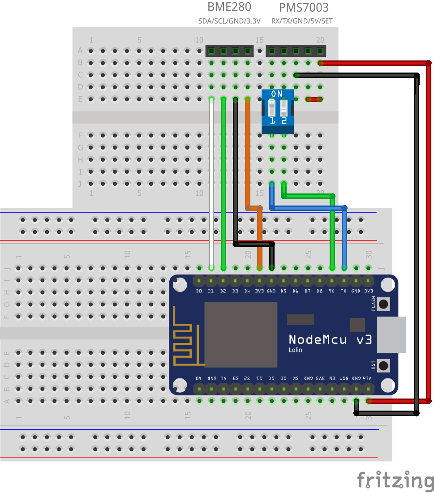

# Homekit_AQI_Desk

## Sensor list
- Bosch BME-280
- Plantower PMS7003

## Library list
- [Mixiaoxiao / Arduino-HomeKit-ESP8266](https://github.com/Mixiaoxiao/Arduino-HomeKit-ESP8266)
- [arkhipenko / TaskScheduler](https://github.com/arkhipenko/TaskScheduler)
- [Adafruit / BME280 Library](https://github.com/adafruit/Adafruit_BME280_Library)
- [fu-hsi / PMS](https://github.com/fu-hsi/PMS)

## Pin mapping

## Case Design
### Cube

